[portfolio](https://faisaljs.github.io) &nbsp;·&nbsp;
[instagram](https://www.instagram.com/faisaljsz)

>  BCA student at IGNOU, developer. Founder of [Leaf-Devs](https://github.com/leaf-devs), a dev community 
> built around the process of turning ideas into real things.

I build Websites, Applications, Bots and the tooling around them. Most of what I ship lives inside 
[Leaf-Devs](https://github.com/leaf-devs), from concept to commit. 
Also deep into Minecraft plugin/mod development and open-source bot infrastructure.

<samp>c &nbsp; python &nbsp; java &nbsp; node &nbsp; postgresql &nbsp; mongodb &nbsp; docker &nbsp; git &nbsp; linux</samp>

**[Groove-Music](https://github.com/faisaljs/Groove-Music)** &nbsp;·&nbsp; <samp>javascript, discord.js</samp> 
Music bot built on Discord's Components V2. The flagship bot of Eleone Hub, 
Premium music, and actively maintained.

**[InstaGrab](https://github.com/faisaljs/InstaGrab)** &nbsp;·&nbsp; <samp>kotlin, yt-dlp</samp> 
A privacy-friendly Android app for downloading public Instagram reels, photos, videos, and carousel posts. 
powered by yt-dlp and kotlin.

**[Python-Codes](https://github.com/faisaljs/Python-Codes)** &nbsp;·&nbsp; <samp>python, codes</samp> 
A community-driven collection of Python projects, exercises, mini-projects, tools, 
and useful examples for learning, practicing, and building with Python.

**[C-Cpp-Codes](https://github.com/faisaljs/C-Cpp-Codes)** &nbsp;·&nbsp; <samp>c, cpp</samp> 
A community-driven collection of C and C++ code, exercises, mini-projects, 
and useful examples for learning and practicing C/C++.

No third-party widgets. No stats cards that go down at 2am. Every graphic 
on this page is generated by [this repo](.github/workflows/stats.yml), pulling 
straight from the GitHub API once a day and committing only what changed.

Built it this way because I got tired of profiles that break. If you want the 
same setup, everything is here: the scripts, the fonts, the workflow. Fork it, 
swap in your username, push. Takes about ten minutes.

The stats workflow uses GitHub's built-in Actions token. To include private activity, 
enable **Private contributions** under your GitHub profile's **Contribution settings**. 
GitHub then exposes anonymized private contribution counts to the profile calendar.
